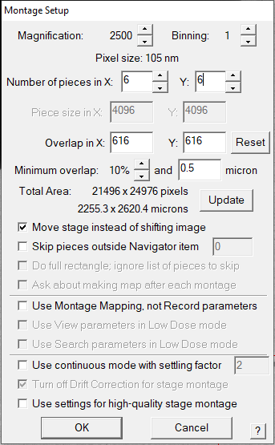
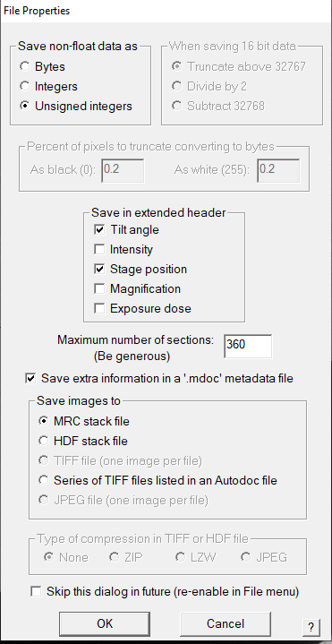
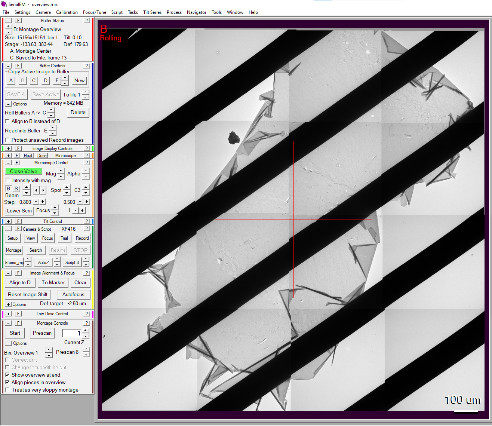
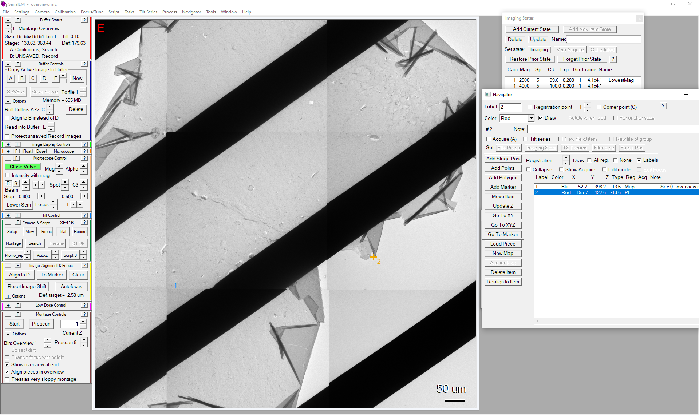
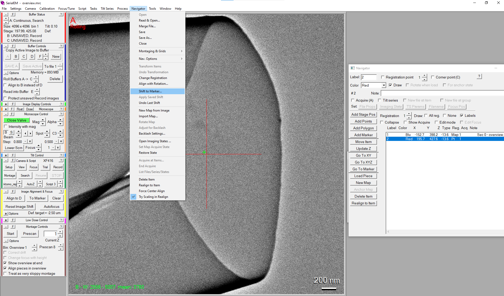
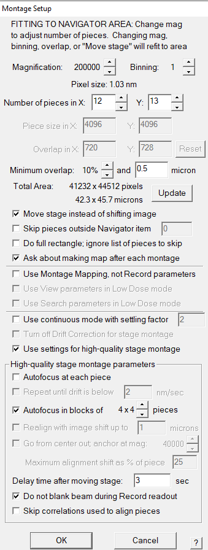
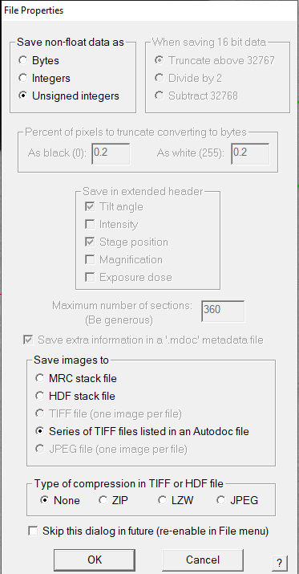
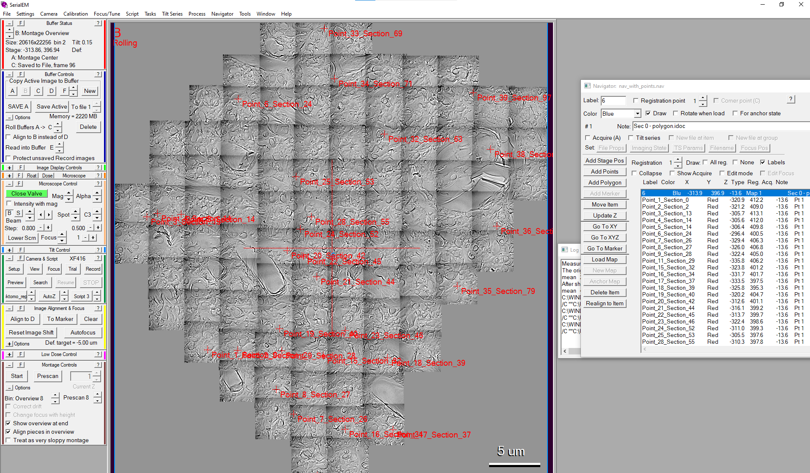
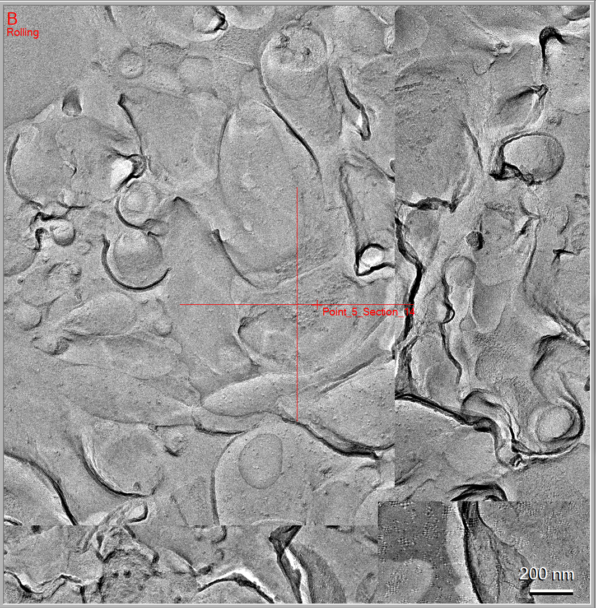

# DarEM

## Installation

Note: the last supported python version is 3.9 as Tensorflow 2.5.1 is not available on later python versions

### Linux
Install the following prerequisites

 * [CUDA Toolkit 11](https://developer.nvidia.com/cuda-toolkit)
    - Required for training or fast prediction on a GPU. Not necessary for slow prediction on a CPU
 * [conda](https://conda.io/projects/conda/en/latest/user-guide/install/index.html) 
    - Using other ways to create virtual python environements is possible, but our installation instructions are based on conda
 * gcc
    - Run `sudo apt install gcc` in a terminal
 * [Protobuf V3.19](https://github.com/protocolbuffers/protobuf/releases/tag/v3.19.4)
 * git
    - Run `sudo apt install git` in a terminal

Open a terminal and run
```bash
conda create -n DarEM python==3.9 cudnn
conda activate DarEM
git clone https://github.com/tensorflow/models.git
cd models/research
git checkout 457bcb8595903331932e2faf95bec8ba69e04688
protoc object_detection/protos/*.proto --python_out=.
cp object_detection/packages/tf2/setup.py .
pip install .
cd ../../
git clone https://github.com/DavidKleindienst/DarEM
cd DarEM
pip install -r requirements.txt
```
To run DarEM run on `python Train.py` for training or `python Predict.py` for Prediction.


### Windows
Ensure the following prerequisites are installed:
 * [CUDA Toolkit 11](https://developer.nvidia.com/cuda-11-8-0-download-archive)
    - Required for training or fast prediction on a GPU. Not necessary for slow prediction on a CPU
 * [conda](https://conda.io/projects/conda/en/latest/user-guide/install/index.html) 
    - Using other ways to create virtual python environements is possible, but our installation instructions are based on conda
 * [Protobuf V3.19](https://github.com/protocolbuffers/protobuf/releases/tag/v3.19.4)
    - Download `protoc-3.19.4-win64.zip` on 64-bit Windows or `protoc-3.19.4-win32.zip` on 32-bit Windows
    - Unzip the downloaded file and add the path to /bin to your PATH environment variable
 * [Visual Studio Build Tools](https://visualstudio.microsoft.com/visual-cpp-build-tools/)
    - In the installer, select "Desktop Development with C++".
    - A reboot may be required
 * [Git](https://git-scm.com/downloads)

Ensure that the conda command is available in powershell
If not open Anaconda prompt and run `conda init powershell`, then open a new powershell. 
If conda is still not available, you need to allow execution of powershell scripts. Open an adminstrator powershell and run `Set-ExecutionPolicy RemoteSigned`. After you open a new powershell, the conda command should now be available

Open a new powershell and run

```powershell
conda create -n DarEM python==3.9 cudnn=8.2
conda activate DarEM
git clone https://github.com/tensorflow/models.git
cd models/research
git checkout 457bcb8595903331932e2faf95bec8ba69e04688
protoc object_detection/protos/*.proto --python_out=.
cp object_detection/packages/tf2/setup.py .
pip install .
cd ../../
git clone https://github.com/DavidKleindienst/DarEM
cd DarEM
pip install -r requirements.txt
```

To run DarEM doubleclick on Train.cmd for training or Predict.cmd for Prediction.

### Setting up the scripts for automatic image acquisition with SerialEM
Copy the contents of the *SerialEMImageAcquisitionScripts* folder to a convenient location on your microscope PC and
ensure [pyEM](https://github.com/asarnow/pyem/tree/master) is installed. You will need to modify the following setting in the *Acquire_Tilt_Series.txt* script dependent on your desired imaging parameters:
* hm_mag
   * the magnification at which the tilt series will be taken
* hm_C2
   * the intensity (C2) setting at which the tilt series will be taken
* tilt_delay
   * the time (in ms) to wait after a tilt for stabilization before starting the acquisition
* offset
   * the defocus at which the eucentric focus is reached, see the comments in the scripts for how to measure this value
   * the correctness of this value should be checked occasionally (especially if you encounter unfocused images) and updated if necessary
* tilt_angles
   * A list of tilt angles at which the images should be taken
   * The default is -24.5, -12.2, 0, 12.2, 24.5
   * Ensure to not take more extreme angles than your microscope setup permits

## Usage

These are some quick instructions including screenshots of relevant settings. Please refer to our book chapter linked [below](#citation) for further details and explanations.

### Acquiring a map
Use *File -> New Montage...* to acquire an overview image of the whole replica. Example setting that we've used:

  

You should obtain an overview image of your replica such as this.



Open the navigator panel with *Navigator -> Open*. Your overview image should alread be contained in the list. Click add points and add a point on an easily recognizable structure (we usually use folds or holes of the replica). Find the same structure at the resolution that you would like to use to search for your profiles of interest and click on it to add the green marker. Then apply *Navigator -> Shift to Marker* (select *All items at the registration of the image with m* in the dialogue box) to register the shift in x/y coordinates between the resolution used on the overview image and the resolution used for acquiring the map

<br>


In the navigator panel select add polygon and draw a polygon around your area of interest. Save the navigator file (*Navigator -> Save*) in the same folder where you will save your images. Set up a polygon montage (*Navigator -> Montaging & Grids -> Setup Polygon Montage*) using setting similar to the following

  

When given the choice to make a map from the montage, answer *Yes*. The montage will now be taken, which may take a while. If you perform the profile detection on a different PC, you can run the profile detection in parallel to the image acquisition (be sure to save your images to a folder that you can access from both PCs in this case). Otherwise (you intend to use your camera PC for profile detection), please wait for the acquisition to finish before you proceed.


### Automatically detecting profiles of interest
When running profile detection from the camera PC, you should be able to select the script for profile detection in the tools window. Running it will open a window where you specify the network you would like to use for the prediction (e.g. you may have different trained networks for detecting different kinds of profiles). The location of your files will be automatically passed to the script. 

When running it on a different PC please open the Prediction Menu and select the appripriate .nav file and the network you would like to use. This prediction can run in parallel to the imaging and will wait for new images to be saved when necessary.

### Acquiring tilt series of the profiles of interest
Use the coords2pts.py script to generate a new .nav file (will be called [your_nav_file_name]_with_points.nav). Close the current file with *File->Close* then use *Navigator->Read & Open...* to read the newly generated navigator file.

You should now see your map with points annotating the found profiles



You can zoom in to verify that the detections correspond to profiles of interest



Open *Navigator -> Acquire at Items* to start the tilt_series of all selected points using the *Acquire_Tilt_Series.txt* script

### Training DarEM for deteting relevant profiles
Please acquire low-res maps as described [above](#acquiring-a-low-res-map), which will serve as training images. Please refer to our boock chapter linked [below](#citation) for instructions on how to annotate the images and train the deep neural network.


## Citation
If you've used this software for your research, please cite

David Kleindienst, Tommaso Costanzo, Ryuichi Shigemoto.
Automated Imaging and Analysis of Synapses in Freeze-Fracture Replica Samples with Deep Learning.
*Neuromethods, Vol. 212*, Joachim Lübke and Astrid Rollenhagen (Eds)
in Press

